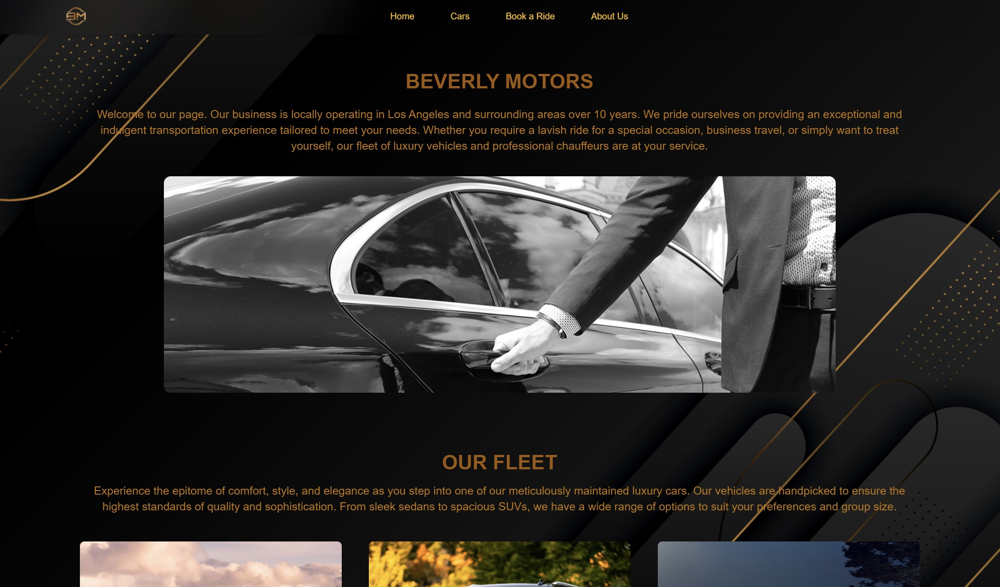

# Beverly Motors Luxury Car Service

This project is for limo company. On website client can order rides , choose desired car type, pick up and drop off location etc.

## Screenshots



## Built With

- 
- 
- 
- 
- 
- 

## Run Locally

Clone the project

```bash
  git clone https://github.com/TigranBalayan10/bm-limo
```

Go to the project directory

```bash
  cd bm-limo
```

Install dependencies from the root folder

```bash
  npm install
```

Start the server

```bash
  npm run develop
```

## Used By

This project is used by the following company:

- Beverly Motors LLC
## Deployed link

https://beverly-motors-db12ef7ee760.herokuapp.com/

## GitHub Repository Link

https://github.com/TigranBalayan10/bm-limo


## License

- [](https://opensource.org/licenses/MIT)

## Contribution

Made by Tigran Balayan

